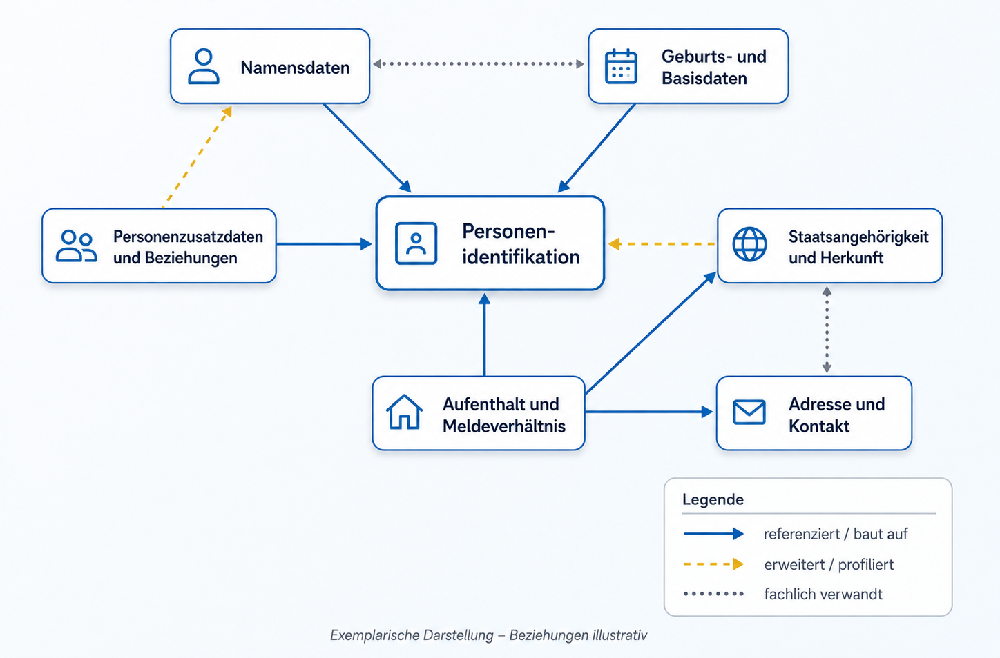

# Demo-Plattform

[Repository Home](../README.md) > Demo-Plattform

---

## Zweck dieses Bereichs

Dieser Ordner enthält eine **Low-Fidelity-Demo der möglichen eCH-Plattform für modulare Building Blocks**.

Die Demo macht exemplarisch sichtbar, wie eCH-Standards künftig nicht nur als vollständige Dokumente, sondern zusätzlich über wiederverwendbare Building Blocks, deren Beziehungen, Versionen und Nutzung in unterschiedlichen Standards erschlossen werden könnten.

Im Mittelpunkt steht dabei nicht eine produktionsreife technische Umsetzung, sondern die **Veranschaulichung möglicher Plattformfunktionen und Informationssichten**. Die Demo dient insbesondere dazu,

* die Building-Block-Logik anhand konkreter Oberflächen greifbar zu machen;
* Beziehungen und Wiederverwendung zwischen Building Blocks sichtbar zu machen;
* mögliche Interoperabilitäts- und Navigationssichten zu erproben;
* Diskussions-, Versions- und Qualitätssicherungsprozesse exemplarisch abzubilden;
* Anforderungen an Datenmodell, Metadaten, Graphmodell und spätere technische Funktionen abzuleiten.

## Rolle der Demo

Die Plattform ist als **Diskussions- und Demonstrationsartefakt** zu verstehen. Inhalte, Kennzahlen, Beziehungen, Statuswerte und Interaktionen sind teilweise vereinfacht oder exemplarisch modelliert.

Die Demo bildet deshalb **keinen verbindlichen eCH-Standardprozess und kein abschliessend validiertes Datenmodell** ab. Sie soll vielmehr zeigen, wie verschiedene Konzepte des Projekts in einer späteren Plattform zusammenspielen könnten.

## Enthaltene Demo-Bereiche

| Bereich | Datei | Zweck |
| --- | --- | --- |
| **NormGraph / Systemübersicht** | [`index.html`](index.html) | Zeigt das konzeptionelle Zusammenspiel von Web-App, Graph-Datenbank, GitHub-Publikation und möglichem Lifecycle der Building Blocks. |
| **NormBrowser** | [`normbrowser.html`](normbrowser.html) | Demonstriert eine Use-Case-getriebene, quellenübergreifende Suche nach Standards und Building Blocks sowie eine mögliche KI-gestützte Zusammenführung. |
| **Interopmatrix** | [`interop_matrix.html`](interop_matrix.html) | Zeigt, welche Building Blocks bzw. Kernkomponenten in ausgewählten Standards verwendet, teilweise verwendet oder nicht verwendet werden. |
| **BB-Graph** | [`graph.html`](graph.html) | Zeigt exemplarisch Building Blocks als Knoten und unterschiedliche Typen von Beziehungen zwischen diesen Knoten. |
| **Building-Block-Detailseite** | [`bb1/bb1.html`](bb1/bb1.html) | Demonstriert eine mögliche Detailansicht mit Metadaten, Versionen, Kennzahlen, Kompatibilitäten und Verweisen auf maschinenlesbare Artefakte. |
| **Diskussionsübersicht** | [`discussions.html`](discussions.html) | Zeigt mögliche Diskussionskanäle, Filter, Aktivitätskennzahlen und Statusinformationen. |
| **Diskussionskanal eines BB** | [`bb1/bb1_discussion.html`](bb1/bb1_discussion.html) | Veranschaulicht Diskussionen, Rückfragen, Änderungsanträge, QS-Schritte und öffentliche bzw. private Beiträge zu einer BB-Version. |

## Exemplarischer Building-Block-Graph

Der vereinfachte Graph illustriert eine zentrale Idee des Projekts: **Building Blocks können nicht nur hierarchisch einem Standard zugeordnet werden, sondern auch untereinander in Beziehung stehen**.

<p align="center">
  
</p>

Im Demo-Graph werden dieselben fachlichen Building-Block-Gruppen verwendet, die auch in der Interopmatrix vorkommen:

* Personenidentifikation;
* Namensdaten;
* Geburts- und Basisdaten;
* Staatsangehörigkeit und Herkunft;
* Adresse und Kontakt;
* Aufenthalt und Meldeverhältnis;
* Personenzusatzdaten und Beziehungen.

Die Kanten zeigen exemplarisch unterschiedliche Beziehungstypen:

| Beziehungstyp | Bedeutung in der Demo |
| --- | --- |
| **referenziert / baut auf** | Ein Building Block verwendet oder benötigt Inhalte eines anderen Building Blocks. |
| **erweitert / profiliert** | Ein Building Block übernimmt Inhalte eines anderen Building Blocks und schränkt, ergänzt oder profiliert diese für einen spezifischeren Kontext. |
| **fachlich verwandt** | Zwischen zwei Building Blocks besteht ein fachlicher Zusammenhang, ohne dass daraus bereits eine direkte Abhängigkeit abgeleitet wird. |

> **Hinweis:** Die im Bild gezeigten Beziehungen sind bewusst illustrativ. Sie dienen dazu, verschiedene Beziehungstypen im Graphmodell zu demonstrieren und sind nicht als normative oder abschliessend fachlich validierte Beziehungen zu verstehen.

## Zugehörige Interop-Matrix

Während der Graph die **Beziehungen zwischen Building Blocks** in den Vordergrund stellt, betrachtet die Interopmatrix die Nutzung derselben Building Blocks **über verschiedene Standards hinweg**.

Die interaktive Demo erlaubt das Auf- und Zuklappen von Building-Block-Gruppen, die Suche nach Standards oder Building Blocks sowie die Anzeige einzelner Unterkomponenten. Für die Dokumentation ist nachfolgend eine bewusst vereinfachte, nicht interaktive Sicht auf die Hauptgruppen dargestellt.

**Legende:** 🔵 verwendet · 🟡 teilweise / profiliert · ⚪ nicht verwendet

| Standard | Personen-identifikation | Namens-daten | Geburts- und Basisdaten | Staatsangehörigkeit und Herkunft | Adresse und Kontakt | Aufenthalt und Meldeverhältnis | Personenzusatzdaten und Beziehungen |
| --- | :---: | :---: | :---: | :---: | :---: | :---: | :---: |
| **eCH-0006 Ausländerkategorien** | ⚪ | ⚪ | ⚪ | ⚪ | ⚪ | 🟡 | ⚪ |
| **eCH-0007 Gemeinden** | ⚪ | ⚪ | ⚪ | ⚪ | ⚪ | 🟡 | ⚪ |
| **eCH-0008 Staaten und Gebiete** | ⚪ | ⚪ | ⚪ | 🟡 | ⚪ | ⚪ | ⚪ |
| **eCH-0010 Postadresse** | 🟡 | 🟡 | ⚪ | 🟡 | 🔵 | ⚪ | ⚪ |
| **eCH-0011 Personendaten** | 🔵 | 🔵 | 🔵 | 🟡 | 🟡 | 🔵 | ⚪ |
| **eCH-0021 Personenzusatzdaten** | 🟡 | ⚪ | ⚪ | ⚪ | ⚪ | ⚪ | 🔵 |
| **eCH-0044 Personenidentifikationen** | 🔵 | 🟡 | 🟡 | ⚪ | ⚪ | ⚪ | ⚪ |

Die Hauptgruppen fassen in der Demo mehrere feinere Komponenten zusammen. Der Status einer Hauptgruppe wird dabei aus den darunterliegenden Komponenten abgeleitet:

* **verwendet**, wenn sämtliche enthaltenen Komponenten verwendet werden;
* **teilweise / profiliert**, wenn mindestens eine enthaltene Komponente verwendet oder teilweise verwendet wird;
* **nicht verwendet**, wenn keine der enthaltenen Komponenten verwendet wird.

Damit lässt sich auf einen Blick erkennen, **wo semantische Überschneidungen, Wiederverwendung oder Profilierungen zwischen Standards auftreten könnten**. Die aufgeklappte interaktive Ansicht erlaubt anschliessend die Analyse auf Ebene einzelner Komponenten.

## Zusammenspiel von Graph und Interopmatrix

Graph und Matrix beschreiben denselben Gegenstandsbereich aus zwei komplementären Perspektiven:

| Sicht | Zentrale Frage | Beispiel |
| --- | --- | --- |
| **BB-Graph** | Wie stehen Building Blocks untereinander in Beziehung? | Baut *Aufenthalt und Meldeverhältnis* auf anderen fachlichen Building Blocks auf? |
| **Interopmatrix** | In welchen Standards werden Building Blocks oder deren Komponenten verwendet? | In welchen Standards kommen Komponenten der *Personenidentifikation* vor? |

In einer späteren technischen Umsetzung könnten beide Sichten auf **demselben maschinenlesbaren Daten- und Beziehungsmodell** basieren. Änderungen an Building Blocks, Versionen oder Beziehungen müssten dann nicht in jeder Darstellung separat gepflegt werden, sondern könnten aus einer gemeinsamen Datenbasis generiert werden.

## Weitere Demo-Funktionen

### NormBrowser

Der NormBrowser zeigt exemplarisch, wie ein konkreter Anwendungsfall als Ausgangspunkt für die Suche nach relevanten Standards und Building Blocks dienen könnte. Die Demo umfasst unter anderem:

* quellenübergreifende Kandidatenlisten;
* Filter nach Quelle, Kategorie, Version und Aktualität;
* Auswahl einzelner Standards oder Building Blocks;
* manuelle oder KI-gestützte Zusammenführung;
* Vorschau eines konsolidierten Ergebnisses;
* mögliche Exporte als Word, PDF oder JSON/YAML.

Die dargestellten Quellen, Treffer und KI-Funktionen dienen in dieser Version primär der Illustration des Zielbilds.

### Building-Block-Detailseite

Die Detailseite am Beispiel **BB-0123 · Anschrift** zeigt, welche Informationen künftig zentral an einem Building Block zusammengeführt werden könnten. Dazu gehören beispielsweise:

* fachliche Beschreibung und Metadaten;
* zugehörige Standards und Schnittstellen;
* Versionshistorie;
* Kompatibilitäten zu anderen Building Blocks;
* Kennzahlen und Aktivitätsinformationen;
* Verweise auf maschinenlesbare Artefakte;
* Verknüpfung mit einem versionsbezogenen Diskussionskanal.

### Diskussion und Lifecycle

Die Diskussionsseiten illustrieren, wie fachliche Rückfragen, Änderungsanträge, Qualitätssicherung und öffentliche Konsultation näher an den jeweiligen Building Block und dessen Version gebracht werden könnten.

Die Demo zeigt unter anderem Statusverläufe, öffentliche und private Beiträge, Filter, Abonnements sowie exemplarische Rücksprünge innerhalb eines möglichen Bearbeitungsprozesses.

## Technisches Grundprinzip

Die Systemübersicht in [`index.html`](index.html) skizziert ein mögliches späteres Zusammenspiel mehrerer Komponenten:

```text
Drupal / öffentliche eCH-Seite
            ↕
     Web-App / Fachanwendung
            ↕
        Graph-Datenbank
            ↓
   genehmigte Versionen
            ↓
      GitHub Repository
```

Die Web-App bildet dabei die operative Arbeits- und Explorationsumgebung. Eine Graph-Datenbank könnte Building Blocks, Versionen, Metadaten und Beziehungen strukturiert verwalten. Genehmigte Versionen könnten anschliessend automatisiert als maschinenlesbare Artefakte über GitHub publiziert und von anderen Anwendungen weiterverwendet werden.

Dieses Architekturmodell ist Teil des Demo-Zielbilds und noch keine Festlegung für eine spätere Produktivarchitektur.

## Demo lokal öffnen

Die statischen Demo-Seiten können grundsätzlich direkt im Browser geöffnet werden. Für eine konsistentere lokale Ausführung empfiehlt sich jedoch ein einfacher lokaler Webserver.

Beispiel mit Python:

```bash
cd 03_demo-platform
python -m http.server 8000
```

Anschliessend kann die Demo unter folgender Adresse geöffnet werden:

```text
http://localhost:8000/
```

Als Einstiegspunkt dient [`index.html`](index.html).

## Ordnerstruktur

Eine vereinfachte Sicht auf die für die Demo wichtigsten Dateien:

```text
03_demo-platform/
├── README.md
├── index.html
├── normbrowser.html
├── interop_matrix.html
├── graph.html
├── discussions.html
├── bb1/
│   ├── bb1.html
│   └── bb1_discussion.html
├── css/
├── img/
│   └── Exemplarischer_Graph.png
├── standards/
└── echstandard-master/
```

Der Unterordner `echstandard-master/` enthält zusätzliche technische Prototyp-Artefakte. Die oben beschriebenen Low-Fidelity-Sichten liegen direkt im Ordner `03_demo-platform/`.

## Zusammenhang mit den weiteren Projektartefakten

Die Demo ist nicht isoliert zu betrachten. Sie ergänzt insbesondere die konzeptionellen Arbeiten zu:

* Building-Block-Guidelines und Nomenklatur;
* Metadaten und maschinenlesbaren Repräsentationen;
* Modellierungsprinzipien;
* Beziehungen und Kompatibilitäten zwischen Building Blocks;
* Versionierung und Lifecycle;
* Wissensgraphen und Interoperabilitätsanalysen;
* möglicher GitHub-basierter Publikation.

Damit kann die Demo zugleich als **Test- und Diskussionsumgebung für Anforderungen** dienen: Erkenntnisse aus der Oberfläche können zurück in Guidelines, Datenmodell und technische Architektur fliessen – und umgekehrt.

## Status

Die Demo-Plattform befindet sich im **Low-Fidelity- bzw. Konzeptstadium**.

Alle dargestellten Inhalte und Funktionen sind als exemplarische Umsetzung zu verstehen. Sie können im Rahmen weiterer Projektphasen, Fachgruppen-Pilotierungen und technischer Evaluationen angepasst, erweitert oder ersetzt werden.
