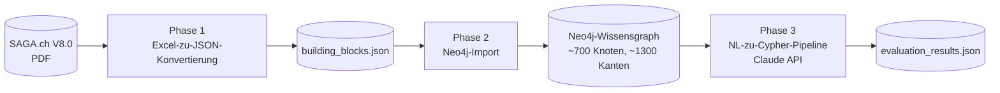

# SAGA.ch Knowledge Graph

> Bachelor-Thesis ZHAW · *Prototypische Modellierung dokumentenzentrierter Architekturstandards als Wissensgraph*
>
**Autor:** Lindrit Ahmetaj · **Betreuung:** Maria Rothstein · **Abgabe:** 27. Mai 2026

**Kontaktdaten von Lindrit Ahmetaj:** lindritahmetaj@hotmail.com, LinkedIn: https://www.linkedin.com/in/lindrit/

Dieses Repository enthält das vollständige Implementationsartefakt zur Bachelor-Thesis: eine dreistufige Pipeline, die den Schweizer eGovernment-Standard **eCH-0014 SAGA.ch V8.0** von der PDF-Vorlage in einen abfragbaren Neo4j-Wissensgraphen überführt und mit einer KI-gestützten Abfrageschicht ergänzt.

---

## Worum geht es?

SAGA.ch definiert auf 143 Seiten, welche IT-Standards in der Schweizer Verwaltung eingesetzt werden sollen — von HTTP über SOAP bis zu ISO-Normen. Als PDF ist dieser Standard für typische Anwenderfragen (z.B. *"Welche Mikros würden von einer Änderung an RFC 7540 betroffen sein?"*) nur eingeschränkt nutzbar.

Diese Arbeit modelliert SAGA.ch als **Wissensgraph in Neo4j** mit rund 700 Knoten und 1'300 Beziehungen und implementiert darauf eine **NL→Cypher-Pipeline** (deutsche natürlichsprachliche Fragen → automatisch generierte Cypher-Abfragen → Resultate aus dem Graphen). Die Übersetzungsqualität wird gegen 12 Testfälle über vier Anwendungsfall-Klassen quantitativ evaluiert.

---

## Pipeline auf einen Blick



| Phase | Was passiert | Hauptdatei | Dokumentation |
| --- | --- | --- | --- |
| **1** | Manuelle Kodierung des PDF in Excel, dann automatische JSON-Konvertierung | `01_excel_to_json/excel_to_bb.py` | [docs/01_kodierungsschema.md](docs/01_kodierungsschema.md) |
| **2** | Idempotenter Neo4j-Import des JSON | `02_neo4j_import/import_saga.py` | [docs/02_neo4j_import.md](docs/02_neo4j_import.md) |
| **3** | NL→Cypher-Pipeline mit Anthropic Claude + Evaluation | `03_nl_to_cypher/nl_to_cypher.ipynb` | [docs/03_nl_to_cypher_pipeline.md](docs/03_nl_to_cypher_pipeline.md) |

---

## Quickstart

### Voraussetzungen

- **Python** ≥ 3.10
- **Docker Desktop** (für Neo4j)
- **Anthropic API Key** ([console.anthropic.com](https://console.anthropic.com))

### Setup

```bash
# 1. Repository klonen
git clone https://github.com/<user>/saga-knowledge-graph.git
cd saga-knowledge-graph

# 2. Python-Umgebung erstellen
python3 -m venv .venv
source .venv/bin/activate          # Windows: .venv\Scripts\activate
pip install -r requirements.txt

# 3. Secrets konfigurieren
cp .env.example .env
# .env öffnen und NEO4J_PASSWORD + ANTHROPIC_API_KEY setzen
```

### Pipeline durchlaufen

**Phase 1 — Excel → JSON** (nur nötig, wenn Excel angepasst wird):

```bash
cd 01_excel_to_json
python excel_to_bb.py \
    --input ../data/input/BB_Standard_Import.xlsx \
    --output ../data/intermediate/building_blocks.json
cd ..
```

**Phase 2 — JSON → Neo4j**:

```bash
cd 02_neo4j_import
docker compose up -d                # Neo4j starten
set -a; source ../.env; set +a      # Env-Variablen laden
python import_saga.py ../data/intermediate/building_blocks.json
cd ..
```

Neo4j Browser unter <http://localhost:7474> (Login `neo4j` / `<NEO4J_PASSWORD>`).

**Phase 3 — NL → Cypher → Evaluation**:

```bash
cd 03_nl_to_cypher
set -a; source ../.env; set +a
jupyter notebook nl_to_cypher.ipynb
```

Im Notebook *Run All Cells* — die Resultate landen in `../data/output/evaluation_results.json`.

---

## Verzeichnisstruktur

```
saga-knowledge-graph/
├── README.md                       Dieses Dokument
├── LICENSE                         Lizenzbestimmungen
├── CITATION.cff                    Wie diese Arbeit zitiert wird
├── requirements.txt                Python-Abhängigkeiten (alle Phasen)
├── .env.example                    Template für lokale .env (gitignored)
│
├── docs/                           Methodik-Dokumentation
│   ├── 00_overview.md              Thesis-Kontext + Pipeline-Diagramm
│   ├── 01_kodierungsschema.md      Methodik Phase 1
│   ├── 02_neo4j_import.md          Methodik Phase 2
│   └── 03_nl_to_cypher_pipeline.md Methodik Phase 3
│
├── 01_excel_to_json/               Phase 1 — Implementation
├── 02_neo4j_import/                Phase 2 — Implementation
├── 03_nl_to_cypher/                Phase 3 — Implementation
│
├── data/                           Datenartefakte
│   ├── input/                      BB_Standard_Import.xlsx
│   ├── intermediate/               building_blocks.json
│   └── output/                     evaluation_results.json
│
└── source_docs/                    Quelldokumente (SAGA.ch PDF, Disposition)
```

---

## Reproduzierbarkeit

Drei Eigenschaften der Pipeline machen die Resultate reproduzierbar:

- **Phase 1** ist deterministisch: dieselbe Excel-Datei produziert immer dasselbe JSON
- **Phase 2** ist idempotent: mehrfache Importe desselben JSON ergeben denselben Graphen (`MERGE` statt `CREATE`)
- **Phase 3** verwendet `temperature=0` für maximale Determinismus der LLM-Generation; ein Stabilitätstest in der Pipeline misst die verbleibende Sampling-Variabilität

Erwartete Werte des V8.0-Datensatzes nach Phase 2: 4 Macros, 32 Mesos, 186 Mikros, 113 Variants, 14 Alternatives, rund 330 External Standards.

---

## Methodik-Dokumentation

Die [Dokumente im Ordner `docs/`](docs/) erklären für jede der drei Phasen das Schema, die Designentscheidungen, die schwierigen Stellen und die Validierung.
