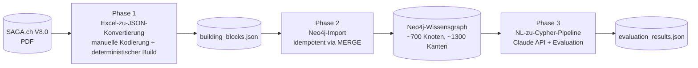

# Methodik-Dokumentation — Übersicht

> **Bachelor-Thesis ZHAW** · *Prototypische Modellierung dokumentenzentrierter Architekturstandards als Wissensgraph*  
> Autor: Lindrit Ahmetaj · Betreuung: Maria Rothstein · Abgabe: März 2026

Dieser Ordner enthält die vollständige methodische Dokumentation der Bachelor-Thesis-Implementation. Die drei Hauptdokumente bilden eine **methodische Trilogie**, die der dreistufigen Pipeline-Architektur der Arbeit entspricht: jede Phase wird in einem eigenen Dokument vollständig erklärt — Zweck, Schema, Designentscheidungen, schwierige Stellen, Validierung.

---

## Thesis-Kontext

SAGA.ch (eCH-0014 V8.0) ist der Schweizer eGovernment-Standard für IT-Architektur — auf 143 PDF-Seiten dokumentiert, mit rund 200 normativ bewerteten Building Blocks für Protokolle, Datenformate, Sicherheits-Standards und Querschnittsthemen. Als PDF ist dieser Standard für typische Anwenderfragen (*"Welche Building Blocks würden von einer Änderung an RFC 7540 betroffen sein?"*, *"Was ist für Schnittstelle S1 dringend empfohlen?"*) nur eingeschränkt zugänglich.

Diese Thesis modelliert SAGA.ch als **Wissensgraph in Neo4j** mit rund 700 Knoten und 1'300 Beziehungen, und implementiert darauf eine **KI-gestützte Abfrageschicht**: natürlichsprachliche Fragen in deutscher Sprache werden automatisch in Cypher-Abfragen übersetzt und gegen den Graphen ausgeführt. Die Qualität dieser Übersetzung wird quantitativ über 12 Testfälle und drei Disposition-Metriken evaluiert.

Methodisch wird in Anlehnung an **Design Science Research Methodology (DSRM, nach Peffers et al.)** vorgegangen — die Pipeline-Implementation ist die Phase *Design & Development* dieses Forschungsansatzes.

---

## Pipeline-Übersicht

---

## Die drei Methodik-Dokumente

| # | Dokument | Phase | Umfang | Schlüsselthemen |
| --- | --- | --- | --- | --- |
| 1 | [`01_kodierungsschema.md`](01_kodierungsschema.md) | PDF → Excel → JSON | ~6'500 Wörter | Kodierungsschema, Disambiguierungsregeln, polymorphe Beziehungen, 6 Designentscheidungen E1–E6, Inter-Coder-Reliabilität |
| 2 | [`02_neo4j_import.md`](02_neo4j_import.md) | JSON → Neo4j | ~5'500 Wörter | Paradigmenwechsel zu Property Graph, Schema (8 Knotentypen + 7 Beziehungstypen), 6 Designentscheidungen D1–D6, Cypher-Pattern, Validierungsstrategie |
| 3 | [`03_nl_to_cypher_pipeline.md`](03_nl_to_cypher_pipeline.md) | NL → Cypher → Evaluation | ~6'500 Wörter | Text-to-Query-Positionierung, System-Prompt-Design, 6 Designentscheidungen E1–E6, Token-Overlap-Scoring, Stabilitätstest, Limitationen über drei Schichten |

Jedes Dokument folgt derselben Struktur: Zweck → Eingabe/Ausgabe → konzeptioneller Hintergrund → Schema/Architektur → Designentscheidungen → Implementation-Detail → schwierige Stellen → Validierung → Limitationen → Disposition-Mapping → Anhang.

---

## Die vier Anwendungsfall-Klassen

Diese vier Klassen bilden die methodische Klammer der gesamten Arbeit. Sie tauchen in allen drei Dokumenten auf — als Anforderungen an die Datenmodellierung (Doc 1), als Validierungsgegenstand der Import-Korrektheit (Doc 2) und als Evaluations-Dimension der NL-Pipeline (Doc 3):

| Klasse | Beschreibung | Beispielhafte Anwenderfrage |
| --- | --- | --- |
| **A — Traceability** | Lokalisierung eines Standards im Dokument und Auflistung seiner Referenzen | *"Wo befindet sich HTTP im SAGA-Standard? Welche RFCs werden referenziert?"* |
| **B — Dependency / Impact** | Rückwärts-Lookup: wenn ein externer Standard sich ändert, wer ist betroffen? | *"Welche Mikros referenzieren IETF RFC 7540?"* |
| **C — Normative Status** | Bewertungs-Abfragen pro Schnittstelle (S1/S2/S3) | *"Welche Building Blocks sind für S1 dringend empfohlen?"* |
| **D — Coverage / Hygiene** | Vollständigkeit und Konsistenz des Datensatzes | *"Welche Mikros haben gar keine Bewertung?"* |

---

## Wo finde ich was?

Cross-Reference-Tabelle für die häufigsten Fragen:

| Wenn du dich fragst… | Schau in… |
| --- | --- |
| Wie wurde das PDF in eine strukturierte Form überführt? | [`01_kodierungsschema.md`](01_kodierungsschema.md) §3–§5 |
| Was bedeutet "Variant vs. Alternative" in der Modellierung? | [`01_kodierungsschema.md`](01_kodierungsschema.md) §6.2 |
| Wie sieht das Neo4j-Schema im Detail aus? | [`02_neo4j_import.md`](02_neo4j_import.md) §4 |
| Warum Neo4j und nicht eine relationale Datenbank oder RDF? | [`02_neo4j_import.md`](02_neo4j_import.md) §3 |
| Warum ist der Import idempotent? Wie wird das garantiert? | [`02_neo4j_import.md`](02_neo4j_import.md) §5 (D2), §6.2 |
| Wie funktioniert die NL→Cypher-Übersetzung technisch? | [`03_nl_to_cypher_pipeline.md`](03_nl_to_cypher_pipeline.md) §4, §5 |
| Wie wurde die Übersetzungsqualität bewertet? | [`03_nl_to_cypher_pipeline.md`](03_nl_to_cypher_pipeline.md) §8 |
| Was sind die ehrlichen Limitationen der Arbeit? | [`03_nl_to_cypher_pipeline.md`](03_nl_to_cypher_pipeline.md) §11 |
| Wie verhält sich die Pipeline reproduzierbar? | Doc 1 §11.3 + Doc 2 §6.2 + Doc 3 §9 |

---

## Mapping auf die Thesis-Kapitel

Jedes Methodik-Dokument enthält am Ende eine Tabelle, die seine Abschnitte auf die Kapitel der schriftlichen Thesis-Disposition mappt. Übergreifend gilt:

| Thesis-Kapitel | Welche Methodik-Dokumente liefern den Inhalt |
| --- | --- |
| §3 Theoretischer Rahmen | Doc 2 §3 (Property-Graph-Modell) + Doc 3 §3 (Text-to-Query-Forschung) |
| §4 Methodik | Doc 1 §3 + Doc 2 §6 + Doc 3 §4, §7–9 |
| §5 Hauptartefakt | Doc 3 gesamt |
| §6 Implementation | Doc 1 §5–§7 + Doc 2 §5, §7 + Doc 3 §5, §6 |
| §7 Evaluation | Doc 3 §8, §10, §12 |
| §8 Diskussion / Limitationen | Doc 1 §10 + Doc 2 §5 (Trade-offs) + Doc 3 §11 |
| §9 Ausblick | Doc 3 §11.1 (Self-Correction, Schema-Linting, Cross-References) |

---

## Hinweise zur Lesereihenfolge

**Wer die Arbeit schnell verstehen will** liest die drei Docs in Reihenfolge (1 → 2 → 3). Jede Stunde Lesezeit pro Doc, knapp drei Stunden total.

**Wer einen spezifischen Aspekt sucht**, geht über die Cross-Reference-Tabelle oben oder direkt in das entsprechende Doc — alle drei sind aufeinander abgestimmt, aber jeweils so geschrieben, dass sie standalone gelesen werden können.

**Wer die Verteidigung vorbereitet**, sollte besonders Doc 3 §11 (Limitationen über drei Schichten) gut kennen — das ist die methodisch ehrlichste Selbstkritik der Arbeit und wahrscheinlich Quelle der schärfsten Fragen.

---

## Verwandte Artefakte ausserhalb von `docs/`

| Artefakt | Pfad | Bezug |
| --- | --- | --- |
| Excel-Erfassungsvorlage | `../01_excel_to_json/BB_Standard_Import.xlsx` | Eingabe von Phase 1 |
| Konvertierungsskript | `../01_excel_to_json/excel_to_bb.py` | Implementation von Phase 1 |
| Import-Skript | `../02_neo4j_import/import_saga.py` | Implementation von Phase 2 |
| Baseline-Queries | `../02_neo4j_import/baseline_queries.cypher` | Ground-Truth-Referenz für Phase 3 |
| Pipeline-Notebook | `../03_nl_to_cypher/nl_to_cypher.ipynb` | Implementation von Phase 3 |
| Evaluations-Resultate | `../data/output/evaluation_results.json` | Output eines Phase-3-Laufs |
| Quelldokument | `../source_docs/STAN_d_DEF_2017-09-13_eCH-0014_V8.0_SAGA.ch.pdf` | Ursprung der gesamten Pipeline |
