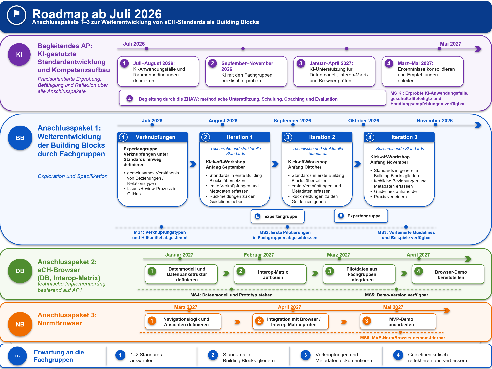
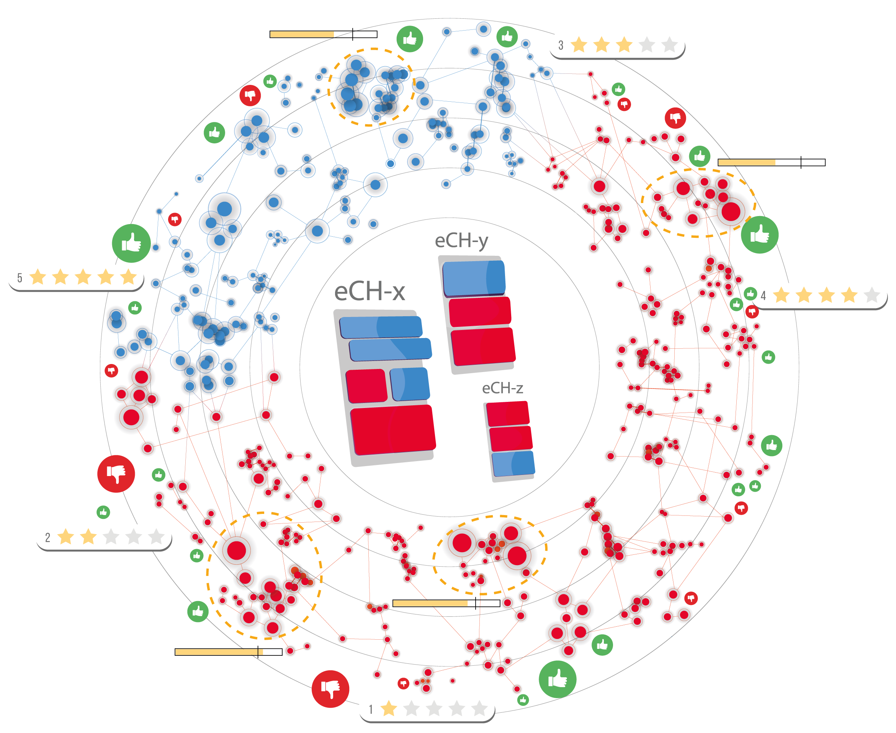
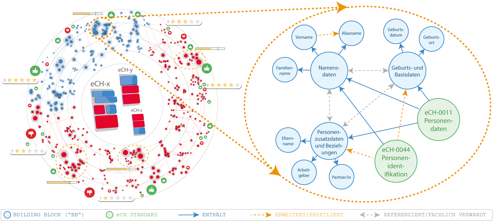

# Beyond PDF: eCH Standards as Building Blocks
## Innovative Standardisierung im eGovernment

## Überblick

Dieses Repository dokumentiert die Ergebnisse und Arbeitsartefakte eines gemeinsamen Projekts von eCH und der ZHAW zur Weiterentwicklung des Umgangs mit eCH-Standards.

Ausgangspunkt des Projekts ist die Frage, wie eCH-Standards künftig besser **beobachtet, gepflegt, weiterentwickelt** und in unterschiedlichen Nutzungskontexten nachvollziehbar eingesetzt werden können. Im Zentrum steht dabei die Idee, Standards nicht nur als monolithische Dokumente zu betrachten, sondern sie in kleinere, fachlich sinnvolle und wiederverwendbare **Building Blocks** zu strukturieren.

Eine solche Struktur kann dazu beitragen, Abhängigkeiten zwischen Standards transparenter zu machen, Überarbeitungsbedarf gezielter zu erkennen, Wiederverwendung über Standards hinweg zu unterstützen und langfristig eine maschinenlesbare Grundlage für Monitoring, Kompatibilitätsanalysen und digitale Plattformfunktionen zu schaffen.

## Projektkontext

eCH-Standards leisten einen wichtigen Beitrag zur Interoperabilität in der digitalen Verwaltung. Gleichzeitig werden Standards zunehmend in komplexen, vernetzten und sich laufend verändernden Nutzungskontexten eingesetzt. Dadurch entstehen neue Anforderungen an Transparenz, Nachvollziehbarkeit, Pflegeprozesse und Weiterentwicklung.

Das Projekt untersucht, wie bestehende Standards modularer beschrieben und mit ergänzenden Informationen angereichert werden können. Ziel ist es, Standards künftig nicht nur als Dokumente zu verwalten, sondern ihre Bestandteile, Abhängigkeiten, Beziehungen und insbesondere die Versionen einzelner Building Blocks systematischer sichtbar zu machen.

Dadurch sollen insbesondere folgende Anliegen unterstützt werden:

* besseres Monitoring der Verwendung und Relevanz von Standards;
* frühere Erkennung von Überarbeitungs- und Aktualisierungsbedarf;
* transparentere Darstellung von Abhängigkeiten zwischen Standards;
* Unterstützung der Fachgruppen bei Pflege und Weiterentwicklung;
* Grundlage für maschinenlesbare Standards, Wissensgraphen und digitale Navigationsfunktionen;
* langfristige Unterstützung von Interoperabilität, Wiederverwendung und Governance.

## Ziel des Projekts

Das Projekt verfolgt das Ziel, Grundlagen für eine a) anwendungsorientiertere Nutzbarkeit, b) eine strukturiertere Pflege und Weiterentwicklung und c) ein verbessertes Monitoring von eCH-Standards zu schaffen.

Dazu werden insbesondere folgende Fragen bearbeitet:

* Wie können bestehende eCH-Standards sinnvoll in Building Blocks gegliedert werden?
* Welche Informationen sollten Building Blocks enthalten, damit sie nachvollziehbar, versionierbar und wiederverwendbar sind?
* Wie können Abhängigkeiten und Kompatibilitäten zwischen Building Blocks sichtbar gemacht werden?
* Wie können Fachgruppen bei der Modularisierung und Pflege ihrer Standards unterstützt werden?
* Wie könnte eine Plattform aussehen, welche Standards, Building Blocks, Abhängigkeiten und Nutzungskontexte verständlich darstellt?
* Welche organisatorischen und technischen Voraussetzungen braucht es für eine spätere operative Umsetzung?

## Roadmap ab Juli 2026

Die folgende Roadmap zeigt das geplante weitere Vorgehen. Sie fokussiert auf die Anschlusspakete 1 bis 3 und beschreibt, wie die bisherigen Ergebnisse schrittweise in eine praxistaugliche Arbeitsgrundlage für eCH, die Fachgruppen und eine mögliche technische Plattform überführt werden sollen. Ergänzend ist ein begleitendes Arbeitspaket vorgesehen, in dem der Einsatz von KI über alle Projektphasen hinweg praxisorientiert erprobt und reflektiert wird.

## Begleitendes Arbeitspaket: KI-gestützte Standardentwicklung und Kompetenzaufbau

Das begleitende Arbeitspaket erstreckt sich über alle drei Anschlusspakete. Gemeinsam mit der ZHAW werden geeignete KI-Anwendungsfälle identifiziert, praktisch erprobt und methodisch reflektiert. Die beteiligten Personen und Fachgruppen werden durch Schulungen, Coaching und konkrete Hilfsmittel beim verantwortungsvollen Einsatz von KI unterstützt.

Mögliche Anwendungsbereiche sind insbesondere die Gliederung von Standards in Building Blocks, die Erarbeitung und Prüfung von Metadaten, die Identifikation von Beziehungen und Abhängigkeiten sowie die Unterstützung bei Recherche, Dokumentation und Qualitätssicherung. Die gewonnenen Erfahrungen sollen abschliessend in Handlungsempfehlungen für den weiteren Einsatz von KI in der Standardentwicklung überführt werden.

## Anschlusspakete

Die Roadmap gliedert das weitere Vorgehen in drei Anschlusspakete:

1. **Anschlusspaket 1: Weiterentwicklung der Building Blocks durch Fachgruppen**

   In einer vorgelagerten Initialisierungsphase definiert eine Expertengruppe zentrale Beziehungstypen und Verknüpfungen über Standards hinweg. Gleichzeitig werden erste Hilfsmittel für die Beschreibung der Building Blocks, die Erfassung von Metadaten sowie den Review- und Diskussionsprozess vorbereitet.

   Anschliessend bearbeiten die Fachgruppen ausgewählte Standards in drei aufeinanderfolgenden Iterationen. Sie gliedern die Standards in Building Blocks, dokumentieren relevante Metadaten und Verknüpfungen und reflektieren die bereitgestellten Guidelines anhand ihrer praktischen Erfahrungen.

   Zwischen den Iterationen wertet die Expertengruppe die gewonnenen Erkenntnisse aus und bereitet die jeweils nächste Iteration vor. Dadurch können das Verknüpfungssystem, die Hilfsmittel und die Guidelines schrittweise verfeinert werden.

2. **Anschlusspaket 2: eCH-Browser (DB, Interop-Matrix)**

   Die Ergebnisse aus Anschlusspaket 1 werden in eine technische Struktur überführt. Dazu werden ein geeignetes Datenmodell und eine Datenbankstruktur definiert sowie eine Interoperabilitätsmatrix aufgebaut. Die in den Fachgruppen erarbeiteten Building Blocks, Metadaten und Verknüpfungen werden als Pilotdaten integriert.

   Darauf aufbauend wird eine erste Browser-Demo bereitgestellt, mit der die technische Machbarkeit und die strukturierte Nutzung der erarbeiteten Inhalte demonstriert werden können.

3. **Anschlusspaket 3: NormBrowser**

   Aufbauend auf den Ergebnissen aus den Anschlusspaketen 1 und 2 wird die Logik eines NormBrowsers weiterentwickelt. Dazu werden geeignete Navigationslogiken und Ansichten definiert und die Integration mit dem eCH-Browser und der Interoperabilitätsmatrix geprüft.

   Ziel ist eine demonstrierbare MVP-Version, welche zentrale Navigations-, Such- und Darstellungsmöglichkeiten eines zukünftigen NormBrowsers exemplarisch aufzeigt.

## Inhalt dieses Repositorys

Dieses Repository enthält die zentralen Artefakte des Projekts. Die Struktur folgt bewusst einer fachlichen Logik: vom Projektkontext über Guidelines und Demonstratoren bis hin zu Beispielen, Präsentationen und Roadmap.

| Ordner                              | Inhalt                                                                                                |
| ----------------------------------- | ----------------------------------------------------------------------------------------------------- |
| `01_project-context/`               | Projektvision, Ausgangslage, Zielbild und Beschreibung des Projektkontexts                            |
| `02_guidelines-for-working-groups/` | Empfehlungen, Leitfragen, Nomenklatur und Modellierungsprinzipien für Fachgruppen                     |
| `03_demo-platform/`                 | Low-Fidelity-Umgebung für eine mögliche Plattform, inklusive Normbrowser und Interoperabilitätsmatrix |
| `04_examples/`                      | Beispielhafte Modellierung von eCH-0014 SAGA.ch als Building Blocks und Wissensgraph                  |
| `05_slides-and-workshops/`          | Präsentationen, Zwischenresultate, Workshop-Unterlagen und Materialien für Projektkommunikation       |
| `06_roadmap/`                       | Vorschlag für das weitere Vorgehen ab Juli 2026, inklusive Roadmap für eCH                            |
| `assets/`                           | Bilder, Vorlagen und weitere unterstützende Materialien                                               |

## Symbolisches Projektbild

Das folgende Bild visualisiert die Grundidee des Projekts: eCH-Standards bestehen aus vielen miteinander verbundenen Elementen, die in unterschiedlichen Kontexten genutzt, bewertet, überarbeitet und kombiniert werden. Diese Komplexität wird bewusst als vernetzte Landschaft dargestellt.

Im Zentrum steht die Idee der Building Blocks: Standards können in fachlich sinnvolle Bausteine gegliedert werden. Diese Bausteine lassen sich beschreiben, versionieren, miteinander verbinden und hinsichtlich ihrer Nutzung, Aktualität und Abhängigkeiten beobachten.

Das Bild ist nicht als fertige technische Architektur zu verstehen. Es dient vielmehr als Zielbild und Gesprächsgrundlage: Es zeigt, weshalb eine modulare und maschinenlesbare Struktur helfen kann, die Pflege, Nutzung und Weiterentwicklung von Standards transparenter, nachvollziehbarer und besser steuerbar zu machen.

## Erwartung an die Fachgruppen

Die Fachgruppen spielen eine zentrale Rolle bei der Weiterentwicklung der Building-Block-Logik. Die Guidelines in diesem Repository sollen deshalb nicht als starres Regelwerk verstanden werden, sondern als gemeinsamer Ausgangspunkt für praktische Arbeit, Rückmeldungen und Weiterentwicklung.

Von den beteiligten Fachgruppen wird insbesondere erwartet, dass sie:

* 1–2 geeignete Standards für die Pilotierung auswählen;
* diese Standards in erste Building Blocks gliedern;
* relevante Verknüpfungen, Abhängigkeiten, Metadaten und Versionierungsinformationen auf Ebene der Building Blocks dokumentieren;
* fachliche Rückmeldungen zur Verständlichkeit und Praxistauglichkeit der Guidelines geben;
* Hinweise darauf liefern, wo unterschiedliche Standardtypen unterschiedliche Modellierungslogiken benötigen;
* zur Weiterentwicklung der Guidelines, Templates und Hilfsmittel beitragen.

## Technische Unterstützung

Das Projekt prüft verschiedene Möglichkeiten, wie Fachgruppen technisch unterstützt werden können. Dazu gehören unter anderem:

* strukturierte Ablage von Standards und Building Blocks in GitHub;
* Issues zur Dokumentation offener Modellierungsfragen;
* Pull Requests für Reviews und nachvollziehbare Änderungen;
* einfache Metadaten-Templates für Building Blocks;
* ein gemeinsames Verzeichnis von Beziehungstypen und Verknüpfungen;
* Visualisierungen von Abhängigkeiten zwischen Standards und Building Blocks;
* Wissensgraphen zur Darstellung fachlicher und technischer Beziehungen;
* eine Interoperabilitätsmatrix zur Analyse von Abhängigkeiten und Kompatibilitäten;
* ein Browser- oder Normbrowser-Konzept zur Navigation durch Standards, Building Blocks und Beziehungen.

## Zielgruppen

Dieses Repository richtet sich an:

* eCH-Fachgruppen, die Standards künftig modular strukturieren oder weiterentwickeln möchten;
* Projektbeteiligte von eCH und ZHAW;
* Entscheidungsträgerinnen und Entscheidungsträger, die sich einen Überblick über Zielbild, Nutzen und weiteres Vorgehen verschaffen möchten;
* technische und fachliche Personen, die an maschinenlesbaren Standards, Interoperabilität, Standard-Monitoring und Wissensgraphen arbeiten.

## Status

Dieses Repository dokumentiert einen laufenden Entwicklungsstand. Die Inhalte sind als Arbeitsgrundlage zu verstehen.

Insbesondere die Guidelines für Fachgruppen sind nicht als abschliessendes Regelwerk gedacht. Sie sollen einen gemeinsamen Startpunkt bieten und durch die praktische Anwendung in Fachgruppen weiterentwickelt werden. Ziel ist ein Vorgehen, das genügend Orientierung bietet, aber gleichzeitig ausreichend Spielraum für unterschiedliche Standards, Fachlogiken und Bedürfnisse lässt.

## Mitwirken und Weiterentwicklung

Die Weiterentwicklung der Inhalte soll schrittweise und gemeinsam mit eCH und den Fachgruppen erfolgen. Rückmeldungen, Ergänzungen und Verbesserungsvorschläge sind insbesondere zu folgenden Punkten willkommen:

* Verständlichkeit der Building-Block-Logik;
* Praxistauglichkeit der Guidelines;
* geeignete Granularität von Building Blocks;
* Anforderungen an Metadaten, Versionierung und Abhängigkeiten;
* mögliche Plattformfunktionen für Navigation, Monitoring und Interoperabilitätsanalysen;
* organisatorische Fragen zur Pflege und Weiterentwicklung der Inhalte.

## Hinweis

Dieses Repository ist Teil eines explorativen Projekts. Es zeigt mögliche Wege auf, wie eCH-Standards künftig modularer, nachvollziehbarer und maschinenlesbarer beschrieben werden könnten. Die hier enthaltenen Inhalte stellen noch keinen verbindlichen eCH-Prozess und keine abschliessende technische Architektur dar.
